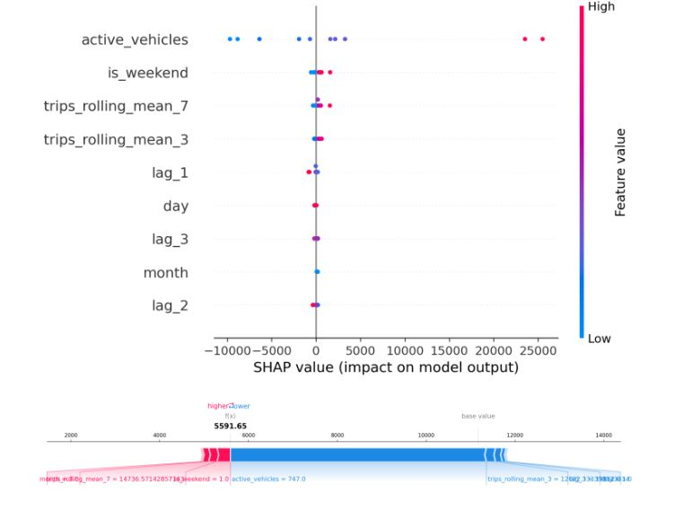
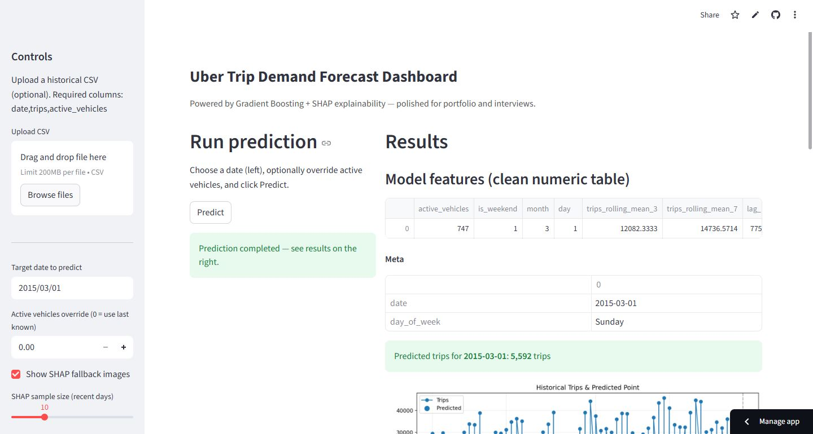

🚖 Uber Trip Demand Forecasting — End-to-End Machine Learning System
By Tabish Deshmukh

  
 
 <b>Production-ready ML pipeline · SHAP Explainability · Interactive Streamlit App</b>  <a href="https://ubertripanalysis-tabish.streamlit.app">🔗 Live Streamlit App</a> 

📌 Project Overview

This project builds a full enterprise-grade ML workflow to forecast daily Uber trip demand (next-day).
The solution reflects real business scenarios: scalable preprocessing, robust model evaluation, explainability, and deployment-ready UI.

### Included Components
- 📊 Exploratory Data Analysis (EDA)  
- 🧪 Feature engineering (lags, rolling windows, weekend encoding, etc.)  
- 🛡 Model training + performance benchmarking  
- 📐 Metrics: MAPE · RMSE · R²  
- 🔍 Global & Local Explainability using SHAP  
- 🖥 Interactive Streamlit dashboard  
- 📘 Professional reports for hiring, interviews & presentations  

## ⭐ Key Results

**🏆 Best Model:** Gradient Boosting Regressor

| Metric    | Score         |
|-----------|---------------|
| **MAPE**  | **7.139%**    |
| **RMSE**  | **1454.74**   |
| **R²**    | **0.983**     |

  

📂 Project Structure
Uber_Trip_Analysis/
│
├── Data/
│ └── Uber-Jan-Feb-FOIL.csv
│
├── models/
│ └── best_model_gradient_boosting.pkl
│
├── Reports/
│ ├── Executive_Summary.md
│ ├── Uber_Trip_Analysis.pdf
│ └── Uber_Trip_Analysis_Presentation.pptx
│
├── images/
│ ├── HistoricalTripsAndPredictedPoints.JPG
│ ├── ModelExplainabilityShap.JPG
│ ├── ShapValue.JPG
│ ├── StreamlitInterface.JPG
│ └── NameBrandingLogo.png
│
├── 01_data_load_and_EDA.ipynb
├── 02_feature_engineering.ipynb
├── 03_train_test_split.ipynb
├── 04_model_building.ipynb
│
├── app_streamlit.py
└── requirements.txt

🔍 Model Explainability (SHAP)
Global SHAP Summary Plot

  

📈 Historical Trips & Predicted Point

  

🖥️ Streamlit Application (Production UI)

  

Features

Upload your own CSV
Override active vehicles
Predict next-day demand
View feature table
Download prediction as CSV
Visualize SHAP explanations
Clean enterprise-styled UI

▶️ Run the App Locally
1. Install dependencies
pip install -r requirements.txt

2. Launch Streamlit
streamlit run app_streamlit.py
Visit http://localhost:8501
 in your browser.

📉 Model Benchmarking
Model	            MAPE (%)	RMSE	    R²
Random Forest	    8.937	    2070.68	    0.966
XGBoost	            8.725	    1798.10	    0.975
Gradient Boosting	7.139	    1454.74	    0.983

🎯 Why This Project Stands Out
This project demonstrates:

✔ End-to-end ML engineering
✔ Robust feature engineering
✔ Time-series aware train/test split
✔ Multiple model comparison
✔ Explainability (SHAP)
✔ Production deployment
✔ High-quality documentation & UI

Perfect for:
ML Engineer roles
Data Scientist interviews
Portfolio showcase
Case study presentation

## 🧭 Future Enhancements

- [ ] 📈 Multi-day forecasting (Prophet, LSTM, TFT)
- [ ] 🌦️ Add weather, event & traffic datasets
- [ ] 🔁 Implement MLflow for tracking + versioning
- [ ] 🚀 Build CI/CD pipeline (GitHub Actions)
- [ ] 🔍 Add model monitoring + drift detection

📬 Contact
Tabish Deshmukh
📧 deshmukhtabish4@gmail.com

📄 License
MIT License — freely available for educational & professional use.